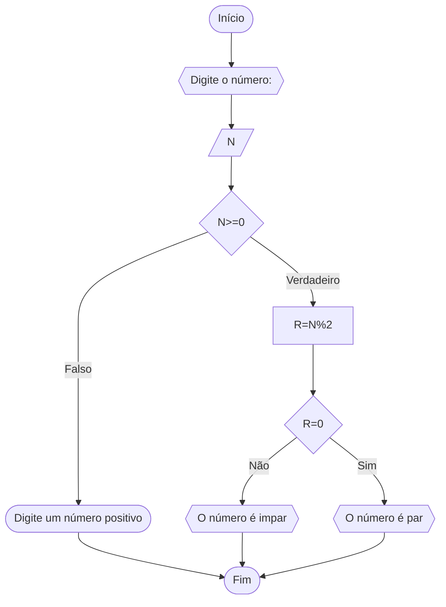

# UNIFOR
**Nome**: Ian Cirino <br>
**Disciplina**: Raciocínio lógico e algorítmo
## Lista de exercícios 1
### Exercício 3
represente, em fluxograma e em pseudocódigo, um algoritmo para determinar se o número inteiro é par ou impar
### Fluxograma

### Pseudocódigo

``` 
ALGORITMO verificar_par_impar:
DECLARE num, resto: INTEIRO
INICIO:
ESCREVA"Digite o nùmero:"
LEIA num
SE num>=0 ENTÃO
	resto <- num%2
	SE resto == 0 ENTÃO
		ESCREVA"O nùmero è par"
	SENAO
		ESCREVA"O nùmero è impar"
	FIM_SE
SENAO
	 ESCREVA "O nùmero deve ser positivo"
FIM_SE
FIM
```

