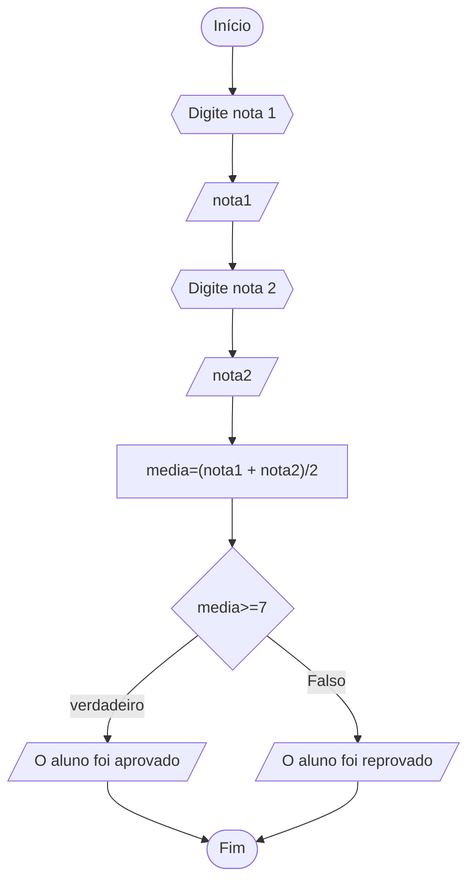
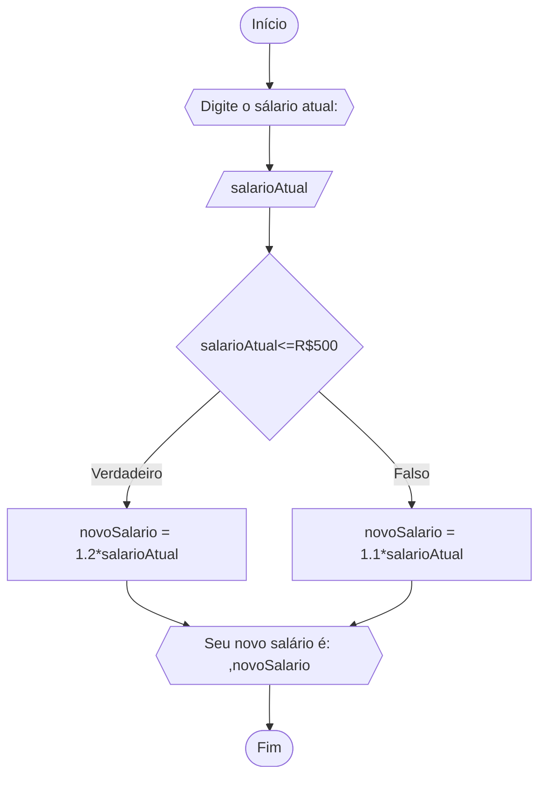
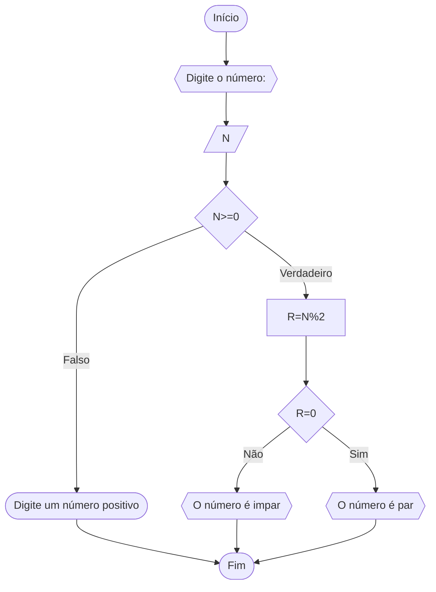
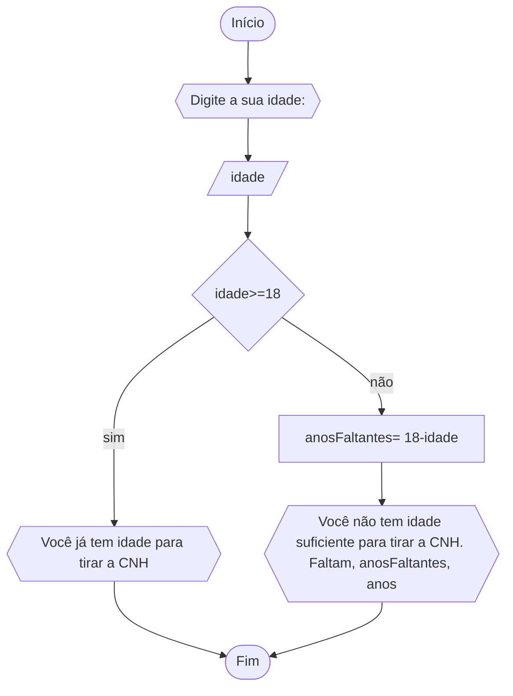

# UNIFOR
**Nome**: Ian Cirino <br>
**Disciplina**: Raciocínio lógico e algorítmo
## Lista de exercícios 1
### Exercício 1
represente, em fluxograma e em pseudocódigo, para calcular a média aritmética entre
duas notas de um aluno e mostrar sua situação, que pode ser aprovado ou reprovado
#### Fluxograma

#### Pseudocódigo
```
Algorítmo Média_notas:
DECLARE média, nota1,nota2: REAL
INÍCIO:
ESCREVA "Digite a nota 1"
LEIA nota1
ESCREVA "Digite a nota 2"
LEIA nota2
media <- (nota1 + nota2)/2
SE media >=7 ENTÃO
	ESCREVA "O aluno foi aprovado!"
SENAO
	ESCREVA "O aluno foi reprovado!"
FIM_SE
FIM
```
####  Teste
| nota1 | nota2 | media | media>=7 | saída |
| -- | -- | -- | -- | -- |
|10| 8| 9| T| O aluno foi aprovado!|
|8| 6| 7| T| O aluno foi aprovado!|
|0| 5 | 2,5|F| O aluno foi reprovado!|
### Exercício 2
Represente, em fluxograma e pseudocódigo, um algoritmo para calcular o novo salário de um
funcionário. Sabe-se que os funcionários que recebem atualmente salário de até R$ 500 terão
aumento de 20%; os demais terão aumento de 10%
#### Fluxograma

#### Pseudocódigo
```
Algorítmo reajuste_salarial:
DECLARE salarioAtual,novoSalario: REAL
INÍCIO:
ESCREVA "Digite salário atual:"
LEIA salarioAtual
SE salarioAtual<=500 ENTÃO
	novoSalario <- 1.2*salarioAtual
SENAO
	novoSalario <- 1.1*salarioAtual
FIM_SE
ESCREVA "Seu novo salário é: ", novoSalario
FIM
```
####  Teste
| salarioAtual |salarioAtual<=500| novoSalario | saída |
| -- | -- | -- | -- |
|400| T|480 | Seu novo salário é: 480|
|500| T | 600|Seu novo salário é: 600 |
|600| F | |Seu novo salário é: 660 |

### Exercício 3
represente, em fluxograma e em pseudocódigo, um algoritmo para determinar se o número inteiro é par ou impar
#### Fluxograma

#### Pseudocódigo

``` 
ALGORITMO verificar_par_impar:
DECLARE num, resto: INTEIRO
INICIO:
ESCREVA"Digite o nùmero:"
LEIA num
SE num>=0 ENTÃO
	resto <- num%2
	SE resto == 0 ENTÃO
		ESCREVA"O nùmero è par"
	SENAO
		ESCREVA"O nùmero è impar"
	FIM_SE
SENAO
	 ESCREVA "O nùmero deve ser positivo"
FIM_SE
FIM
```
#### Teste
| num |  num>=0 | resto | resto == 0 | saída |
| -- | -- | -- | -- | -- |
|-1| False| | | O número deve ser positivo|
|0| True | 0| True| O número é par|
|10|True|0|True| O número é par|
|11|True|1|False|O número é impar|

### Exercício 4
Represente, em fluxograma e pseudocódigo, um algoritmo que, a partir da idade do candidato(a),
determinar se pode ou não tirar a CNH. Caso não atender a restrição de idade, calcular quantos
anos faltam para o candidato estar apto.
#### Fluxograma

#### Pseudocódigo
```
Algorítmo idade_CNH:
DECLARE idade: REAL
INÍCIO:
ESCREVA "Digite sua idade:"
LEIA idade
SE idade>=18 ENTÃO
	ESCREVA "Você já tem idade para tirar a CNH!"
SENAO
	anosFaltantes <- 18-idade
	ESCREVA "Você não tem idade suficiente para tirar a CNH. Faltam, anosFaltantes, anos."
FIM_SE
FIM
```
####  Teste
| idade |idade>=18| saída |
| -- | -- | -- | 
|20| T| Você já tem idade para tirar a CNH!| 
|18| T | Você já tem idade para tirar a CNH!|
|16| F | Você não tem idade suficiente para tirar a CNH. Faltam 2 anos.|


