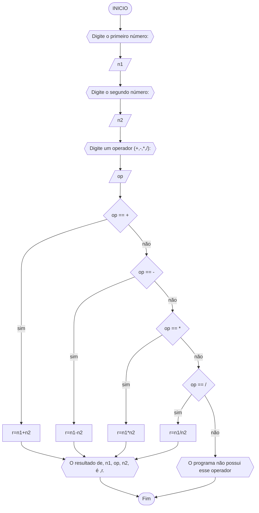

# UNIFOR
**Nome**: Nome do estudante <br>
**Disciplina**: Raciocínio lógico algorítm

## Exercício exemplo
Represente, em fluxograma e pseudocódigo, um algoritmo para calcular o adicional de salário de funcionário por cargo de uma empresa fictícia. Sabe-se que os funcionários de cargo técnico receberão reajuste de 50%, cargo de gerência, um reajuste de 30% e demais, um reajuste de 10%. 

#### Fluxograma


#### Pseudocódigo
```
1  ALGORITMO calReajuste
2  DECLARE  sal, sal_reaj: real, prof: caractere
3  INICIO
4  LEIA sal, prof
5  ESCOLHA
6   CASO prof == “Técnico”		// caso 1
7     sal_reaj ← 1.5 * sal
8   CASO prof = “Gerente”		// caso 2
9     sal_reaj ← 1.3 * sal
10  SENÃO
11    sal_reaj ← 1.1 * sal
12 FIM_ESCOLHA
13 ESCREVA “Salário Reajustado = “, sal_reaj
14 FIM
```

#### Teste
| sal | prof | prof == “Técnico” | prof = “Gerente” | sal_reaj | Saída |
| -- | -- | -- | -- | -- | -- |
| 1000 | Técnico | V | F | 1500 | “Salário Reajustado = 1500“ |
| 2000 | Gerente | F | V | 2600 | “Salário Reajustado = 2600“ |
| 9000 | Diretor | F | F | 9900 | “Salário Reajustado = 9900“ |

## Lista de exercícios 02

### Exercício 01 (2.5 pontos)
Calcule a média de quatro números inteiros dados.

#### Fluxograma (1.0 ponto)


#### Pseudocódigo (1.0 ponto)

```
Algoritmo media_num
DECLARE n1,n2,n3,n4, media: INTEIRO
INÍCIO:
ESCREVA"Digite o primeiro nùmero:"
LEIA n1
ESCREVA"Digite o segundo nùmero:"
LEIA n2
ESCREVA"Digite o terceiro nùmero:"
LEIA n3
ESCREVA"Digite o quarto nùmero:"
LEIA n4
media <- (n1+n2+n3+n4)/4
ESCREVA " Média igual à ", media
FIM
```

#### Teste de mesa (0.5 ponto)

| n1|n2 | n3| n4  | media |Saída|
|      --      |      --      |      --      |       --      |   --      | --      |   
| 7| 2| 5| 3|8,5| Média igual à 8,5

### Exercício 02 (2.5 pontos)
Leia uma temperatura dada em Celsius (C) e imprima o equivalente em Fahrenheit (F). (Fórmula de conversão: F = (9/5) * C + 32)

#### Fluxograma (1.0 ponto)


#### Pseudocódigo (1.0 ponto)

```
Algoritmo temperatura
DECLARE Tc,Tf: REAL
INÍCIO:
ESCREVA"Digite a temperatura em Celsius:"
LEIA Tc
Tf <- (9/5)Tc+32
ESCREVA "A temperatura em Fahrenheit é:  ", Tf
FIM
```

#### Teste de mesa (0.5 ponto)

| Tc|Tf | Saída|
|      --      |      --      |      --      |  
| 0| 32| A temperatura em Fahrenheit é:  32 | 

### Exercício 03 (2.5 pontos)
Receba dois números reais e um operador e efetue a operação correspondente com os valores recebidos (operandos). 
O algoritmo deve retornar o resultado da operação selecionada simulando todas as operações de uma calculadora simples.


#### Fluxograma (1.0 ponto)



#### Pseudocódigo (1.0 ponto)

```
Algoritmo Calculadora
DECLARE n1,n2,r: REAL
DECLARE op: TEXTO
DECLARE v: BOOLEANO
INÍCIO:
ESCREVA "Digite o primeiro número: "
LEIA n1
ESCREVA "Digite o segundo número: "
LEIA n2
ESCREVA "Digite um operador (+,-,*,/):"
LEIA op
v <- TRUE
SE op == + ENTÃO
	r <- n1+n2
SE op == - ENTÃO
	r <- n1-n2
SE op == * ENTÃO
	r <- n1*n2
SE op == / ENTÃO
	r <- n1/n2
SENAO
	v <- FAlSE
FIM_SE
SE v == True ENTÂO
	ESCREVA "O resultado de ", n1, op, n2," é ",r.
SENAO
	ESCREVA "O programa não possui esse operador"
FIM_ALGORITMO
```

#### Teste de mesa (0.5 ponto)

| n1 | n2 | op|op==+|op==-|op==*|op==/|v | saída | 
|      --      |      --      |      --      |      --      |      --      |  --      |  --      |  --      |  --      | 
| 1  | 2      | +   |  T  | F |F|F|T| O resultado de 1 + 2 é 3
| 2  | 1      | -   |  F  | T |F|F|T| O resultado de 2 - 1 é 1 |
| 3  | 2      | *  |  F | F |T|F|T| O resultado de 3 * 2 é 6
| 4 | 2      | /  |  F  | F |F|T|T| O resultado de 4 / 2 é 2
| 1  | 2      | ?   |  F  | F |F|F|F| O programa não possui esse operador

### Exercício 04 (2.5 pontos)
Elaborar um algoritmo que, dada a idade, classifique nas categorias: infantil A (5 - 7 anos), infantil B (8 -10 anos), juvenil A (11 - 13 anos), juvenil B (14 -17 anos) e adulto (maiores que 18 anos).
#### Fluxograma (1.0 ponto)


#### Pseudocódigo (1.0 ponto)

```
Algoritmo categoria_idade
DECLARE idade: REAL
INÍCIO:
ESCREVA"Digite sua idade:"
LEIA idade
SE 7>=idade>=5 ENTÃO
	ESCREVA"você pertence a categoria infantil A"
SE 10>=idade>=8 ENTÃO
	ESCREVA"você pertence a categoria infantil B"
SE 13>=idade>=11 ENTÃO
	ESCREVA"você pertence a categoria juvenil A"
SE 17>=idade>=14 ENTÃO
	ESCREVA"você pertence a categoria juvenil B"
SE idade>=18 ENTÃO
	ESCREVA"você pertence a categoria adulto"			
SENAO
	ESCREVA "Você não pertence a nenhuma categoria"
FIM_SE
FIM
```

#### Teste de mesa (0.5 ponto)

| idade |Saída|
|      --      |      --      |    
| 6| você pertence a categoria infantil A| 
| 9| você pertence a categoria infantil B| 
| 13| você pertence a categoria juvenil A| 
| 16| você pertence a categoria juvenil B| 
| 19| você pertence a categoria adulto| 
| 2| você não pertence a nenhuma categoria| 
